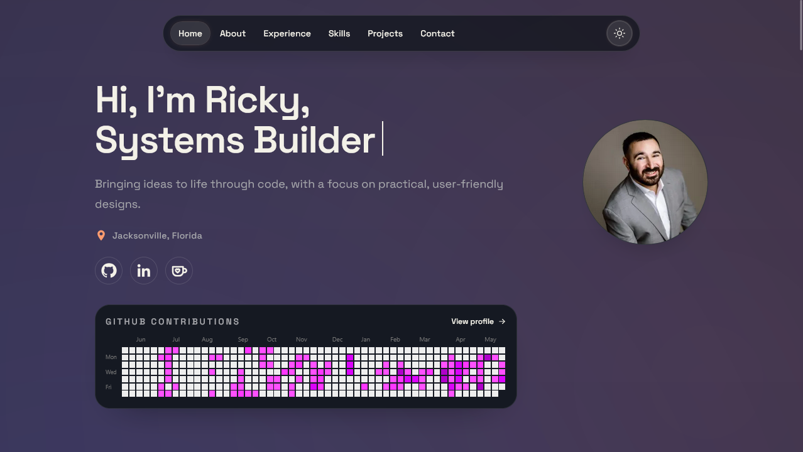
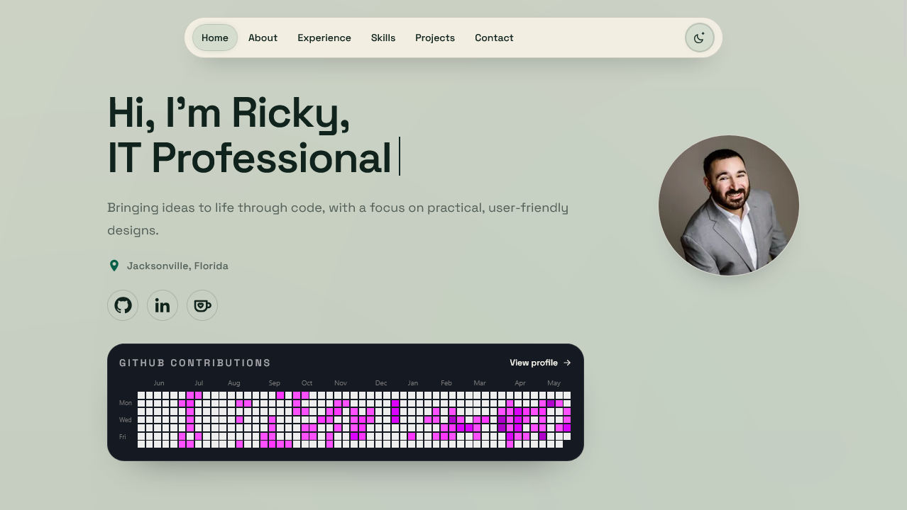
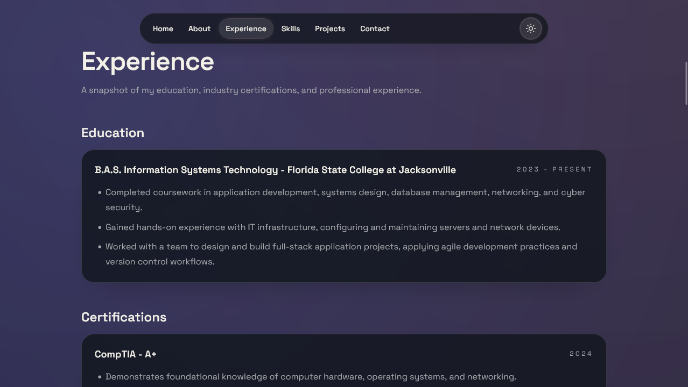
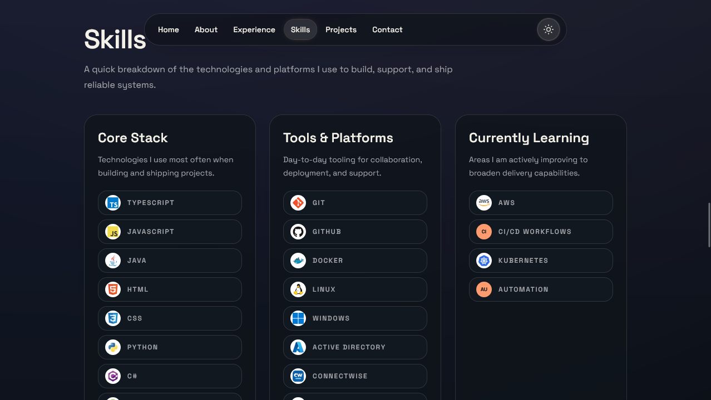
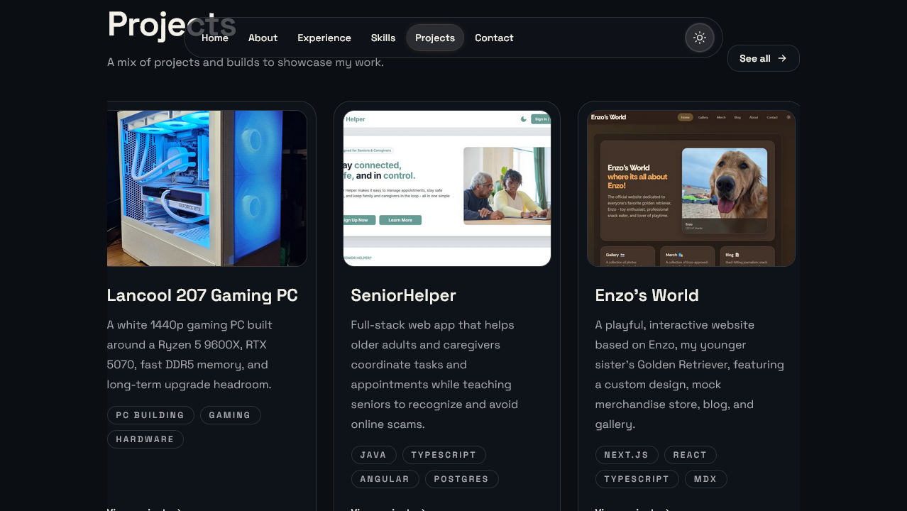
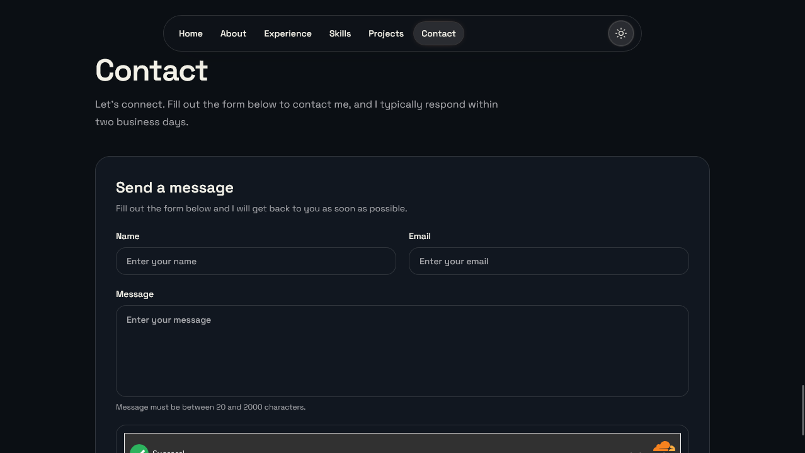

# Portfolio

This portfolio is a Next.js app that highlights my development work, technical experience, and IT support background. It keeps the presentation clean and personal while giving each project space for a quick overview and the technical details behind it.

## Screenshots

<table>
  <tr>
    <td></td>
    <td></td>
  </tr>
  <tr>
    <td></td>
    <td></td>
  </tr>
  <tr>
    <td></td>
    <td></td>
  </tr>
</table>

## Architecture and Stack

- **Framework:** Next.js App Router with React and TypeScript.
- **Content:** Typed project, experience, education, certification, and skill data managed in local content modules.
- **Case studies:** MDX project pages using a shared layout for consistent summaries, screenshots, problem statements, implementation notes, and project details.
- **Styling:** Tailwind CSS with CSS variables for theme-aware color tokens and responsive layouts.
- **Assets:** Project screenshots served from the public project asset directory.
- **Contact:** Cloudflare Turnstile protects the contact form before messages are sent through Resend.

## Environment Variables

The contact form requires these values in local development and production:

- `NEXT_PUBLIC_TURNSTILE_SITE_KEY`
- `TURNSTILE_SECRET_KEY`
- `RESEND_API_KEY`
- `CONTACT_FROM_EMAIL`
- `CONTACT_TO_EMAIL`

## Design and UX Decisions

- Kept the homepage focused on scanning: hero, about, experience, projects, skills, and contact sections are easy to move through without extra navigation friction.
- Used project cards with screenshots and tags so visitors can quickly understand the type, stack, and purpose of each build.
- Added dedicated case-study pages for projects that need more explanation than a card can provide.
- Used consistent spacing, typography, and theme tokens so the site feels cohesive across sections.

## Maintainability Choices

- Project metadata lives in one typed content source, while long-form writeups live in MDX pages.
- The shared case-study layout reduces repeated markup across project pages.
- Image paths and alt text are defined alongside project content to keep visual assets easy to audit.
- The structure leaves room for additional projects, live links, repositories, and expanded technical notes as the portfolio evolves.
